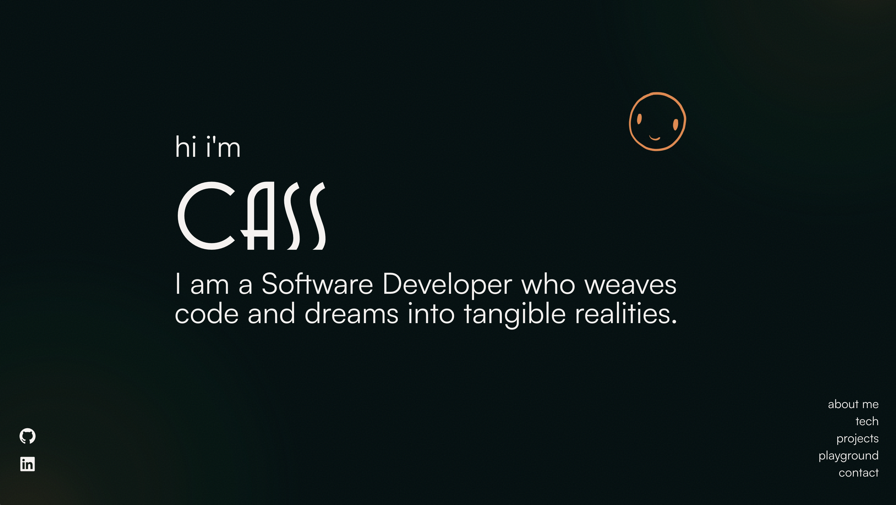

<div align='center'>
    
</div>
<h1 align='center'>
  hicass.dev - v3
</h1>
<p align='center'>
  The third version of <a href='https://www.hicass.dev/' target='_blank'>hicass.dev</a> built with <a href='https://nextjs.org/' target='_blank'>Next.js</a> and hosted with <a href='https://vercel.com/' target='_blank'>Vercel</a>
</p>

<div align='center'>
    
</div>


## Tech Stack

**Client:** 
- [Next.Js](https://nextjs.org/)
- [Framer Motion](https://www.framer.com/motion/)
- [Tailwind CSS](https://tailwindcss.com/)
- [Email.Js](https://www.emailjs.com/)
- [Validator](https://www.npmjs.com/package/validator)
- [React Icons](https://react-icons.github.io/react-icons/)

**Server:** 
- [Node](https://nodejs.org/en)

**Deployment:**
- [Vercel](https://vercel.com/)

## Features

- A comprehensive look into who I am as a Developer and the projects I have created.
- Responsive Design.
- Contact form with email verification and sent confirmation message.
- Dynamic animations for an engaging user experience.

## Setup and Installation

1. **Clone the repository:**

   ```bash
   git clone https://github.com/hicass/portfolio-v3.git

   ```

2. **Install dependencies:**

   ```bash
   npm install

   ```
3. **Install dependencies:**

   - Create `.env`
   - Create an account on [Email.JS](https://www.emailjs.com/) and retrieve your email key
   - Fill in the necessary environment variables:

   ```
   NEXT_PUBLIC_EMAIL_KEY=<enter your key here>
   ```

4. **Run the development server:**

   ```bash
   npm run dev
   ```

# Style Guide

## Color Reference

| Color             | Hex                                                                |
| ----------------- | ------------------------------------------------------------------ |
| White |  #f6f2f0|
| Orange |  #ef8645 |
| Green |  #24372a |
| Dark Green 1 |  #111f1b |
| Dark Green 2 |  #192c26 |
| Background |  #081712 |


#### There are orbs in the background that are comprised of outer, inner and center divs to help smoothen the gradient, they use the following colors:

| Color             | Hex                                                                |
| ----------------- | ------------------------------------------------------------------ |
| Orb Outer |  #0c412c |
| Orb Inner |  #914618 |
| Orb Center |  #ef8645 |

## Font Reference

### Primary Font

- **Font Name:** Universal Expansion
- **Usage:** Headings
- **Link:** [Free Font - Universal Expansion Font](https://www.behance.net/gallery/206662013/Free-Font-Universal-Expansion-Font?tracking_source=search_projects%7Cfree+font&l=699)

### Secondary Font

- **Font Name:** Satoshi
- **Usage:** Body text
- **Link:** [Fontshare Satoshi](https://www.fontshare.com/fonts/satoshi)